# react-native-maui

React Native UI Library

Component animations are implemented by `react-native-reanimated` and `react-native-gesture-handler`

All files are 100% typescript,and Support iOS & Android

## Preview

| Button  | Badge  |  Divider  |
| ------------- | ------------- | ------------- | 
| 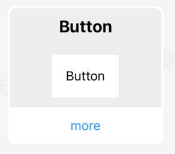  | 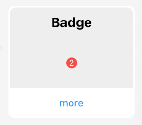  |  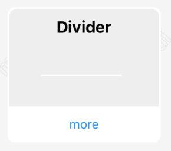 |

| Avatar  | ListRow  |  AnimatedNumber  |
| ------------- | ------------- | ------------- | 
| 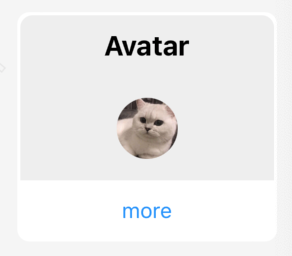  | 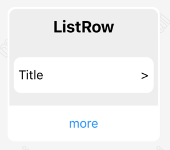  |  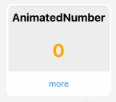 |

| Progress  | Shadow  |  Loading  |
| ------------- | ------------- | ------------- | 
|   | 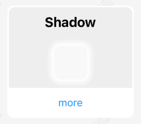  |   |

| Toast  | Pagination  |  SliderSelect  |
| ------------- | ------------- | ------------- | 
| 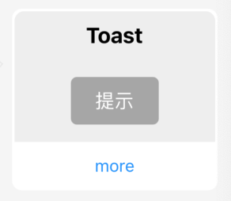  | 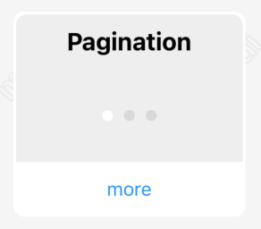  |   |

| Theme  | Collapse  |  Overlay  |
| ------------- | ------------- | ------------- | 
| 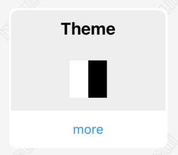  |    |  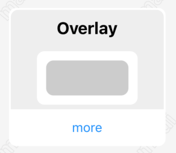 |

| ActionSheet  | SliderSheet  |  Picker  |
| ------------- | ------------- | ------------- | 
| 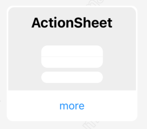  | 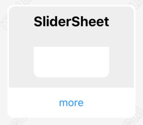  |  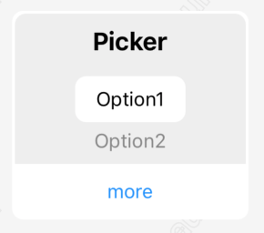 |

| Skeleton  | Swiper  |  ImageViewer  |
| ------------- | ------------- | ------------- | 
| 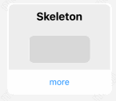  | 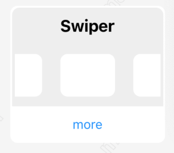  |   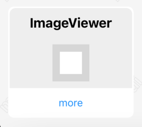 |

| RefreshList  | Switch  |
| ------------- | ------------- |
| 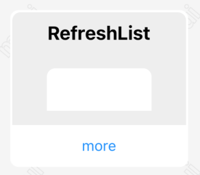  | 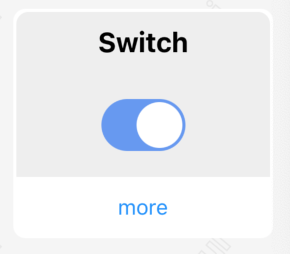  |


## Installation

Before Installation, Make sure have installed `react-native-reanimated`、`react-native-gesture-handler` and `react-native-svg`:

```
npm install react-native-reanimated react-native-gesture-handler react-native-svg
npx pod-install
```

For more information, please check 
- [react-native-reanimated](https://github.com/software-mansion/react-native-reanimated)
- [react-native-gesture-handler](https://github.com/software-mansion/react-native-gesture-handler)
- [react-native-svg](https://github.com/react-native-svg/react-native-svg)

Install the `react-native-maui` with:
```
npm install react-native-maui
```

Then use by:
```
import { Button } from 'react-native-maui'
```

## Expo Demo
[Expo HomePage](https://expo.dev/@mah22/react-native-maui-example?serviceType=classic&distribution=expo-go)

Scan the QR code with Expo Go (Android) or the Camera app


## License

Under The MIT License.

