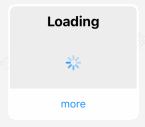
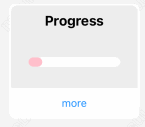
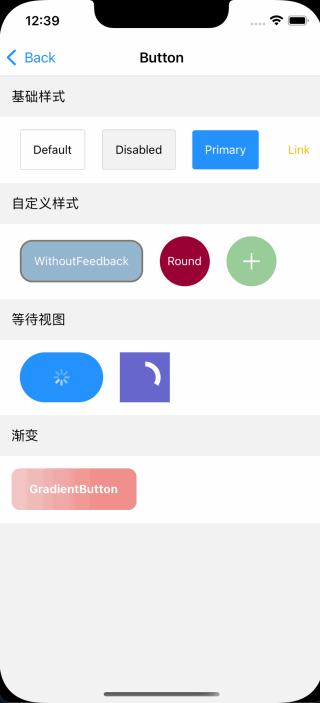
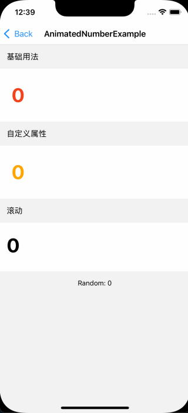
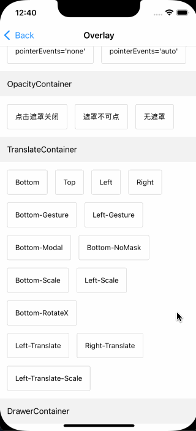
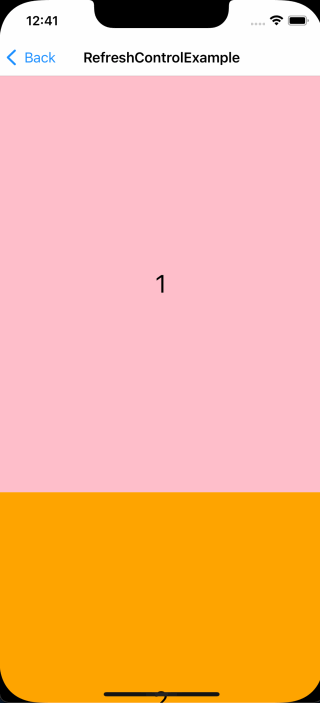

# react-native-maui

[中文文档](https://github.com/mahaaoo/react-native-maui/blob/main/README.zh.md)

This project contains the basic components commonly used in ReactNative. All components are implemented by `funciton components` and `hooks`, coded in `typescript`. Animations and interactions are implemented by `react-native-reanimated`, `react-native-gesture-handler` and `react-native-svg`.

> This project is developed by individuals, the stability and adaptability of the components cannot be guaranteed, please use with caution

## Update
* Move `Overlay` to [react-native-ma-modal](https://github.com/mahaaoo/react-native-ma-modal)

## Preview

| Loading | Progress | Button | 
| ------------- | ------------- | ------------- | 
|  |   |   |


| AnimatedNumber | Overlay | RefreshScrollView |
| ------------- | ------------- | ------------- | 
|   |   |   |


| Carousel | WaterfallList | More Demos |
| ------------- | ------------- | ------------- |
|   |   |  |


## Installation

Before Installation, Make sure have installed `react-native-reanimated`、`react-native-gesture-handler` and `react-native-svg`:

```
npm install react-native-reanimated react-native-gesture-handler react-native-svg
npx pod-install
```

For more information, please check 
- [react-native-reanimated](https://github.com/software-mansion/react-native-reanimated)
- [react-native-gesture-handler](https://github.com/software-mansion/react-native-gesture-handler)
- [react-native-svg](https://github.com/react-native-svg/react-native-svg)

Install the `react-native-maui` with:
```
npm install react-native-maui
```

Then use by:
```
import { Button } from 'react-native-maui'
```

## Expo Demo
[Expo HomePage](https://expo.dev/@mah22/react-native-maui-example?serviceType=classic&distribution=expo-go)

Scan the QR code with Expo Go (Android) or the Camera app


## License

Under The MIT License.

