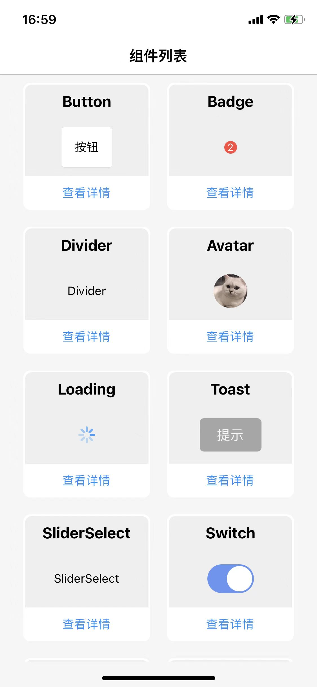
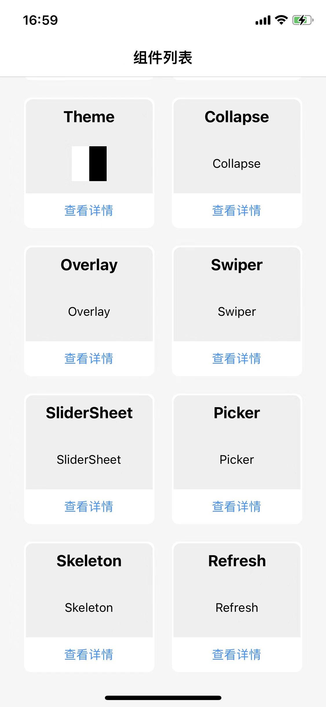

# react-native-maui

React Native components implemented by `react-native-reanimated v2` and `react-native-gesture-handler v2` 

Support iOS & Android

## Preview
### iOS

### Android

## expo demo
[expo home page](https://expo.dev/@mah22/maui?serviceType=classic&distribution=expo-go)

Scan the QR code with Expo Go (Android) or the Camera app

