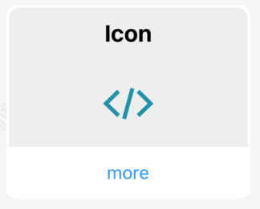
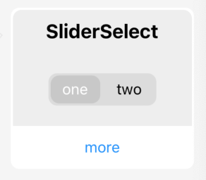
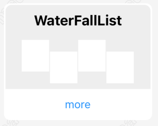

# react-native-maui

此项目包含了ReactNative中常用的基础组件，代码基于RN0.68（尽量与最新版同步）。所有的组件均由funciton components和hooks的实现，采用typescript编码。
动画及交互效果由`react-native-reanimated`、`react-native-gesture-handler` 和 `react-native-svg`实现。

> 此项目由个人开发，不能保证组件的稳定性及适配度，请谨慎使用

## For Learning

你可以在本项目中学习到
- RN的基础用法
- 组件封装及调用
- 开源项目的组织结构
- funciton components和各种hooks的用法
- `react-native-reanimated2`、`react-native-gesture-handler2` 和 `react-native-svg`使用方法
- 组件及hook的单元测试
- Expo工具链

## Preview

|  |   |   |
| ------------- | ------------- | ------------- | 
|   |   |   |
|   |   |   |
|   |   |   |
|   |    |   |
|   |   |   |
|   |    |    |
|  |   | 


## Installation

在安装之前react-native-maui之前，首先要确保项目中已经安装好了`react-native-reanimated`、`react-native-gesture-handler` and `react-native-svg`，可以使用如下命令进行安装：

```
npm install react-native-reanimated react-native-gesture-handler react-native-svg
npx pod-install
```

如果遇到问题，可以查看对应官网
- [react-native-reanimated](https://github.com/software-mansion/react-native-reanimated)
- [react-native-gesture-handler](https://github.com/software-mansion/react-native-gesture-handler)
- [react-native-svg](https://github.com/react-native-svg/react-native-svg)

通过以下命令安装`react-native-maui`
```
npm install react-native-maui
```

使用:
```
import { Button } from 'react-native-maui'
```

## Expo Demo
[Expo HomePage](https://expo.dev/@mah22/react-native-maui-example?serviceType=classic&distribution=expo-go)

也可以使用Expo Go客户端扫描下方二维码，进行体验


## License

Under The MIT License.
